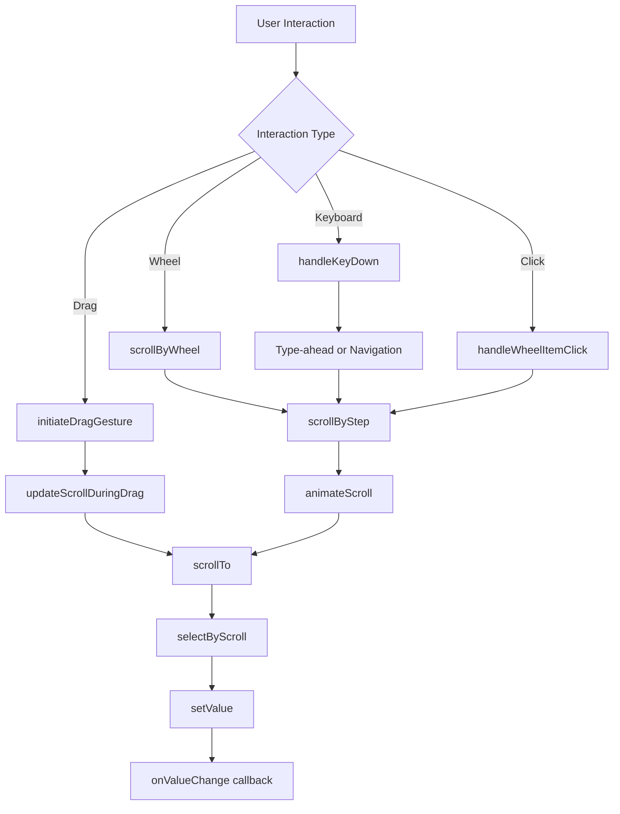

## Overview

React Wheel Picker consists of two main components that work together to create the 3D wheel selection experience:

- **WheelPickerWrapper** - Container component that provides context for multiple pickers
- **WheelPicker** - The core wheel picker component with 3D rendering

## Component Anatomy

### WheelPickerWrapper

The wrapper component provides a context provider for managing multiple wheel pickers in a group. It enables keyboard navigation between pickers using Arrow Left/Right keys.

```tsx
const WheelPickerWrapper: React.FC<WheelPickerWrapperProps> = ({
  className,
  children,
}) => {
  return (
    <WheelPickerGroupProvider>
      <div className={className} data-rwp-wrapper>
        {children}
      </div>
    </WheelPickerGroupProvider>
  );
};
```

**Key Features:**
- Wraps multiple pickers in a context provider
- Manages active picker state for keyboard navigation
- Applies `data-rwp-wrapper` attribute for CSS targeting
- Sets up perspective for 3D transforms (`perspective: 2000px`)

### WheelPicker Component

The main picker component that renders a 3D cylindrical wheel interface.

#### Component Structure

```tsx
<div
  ref={containerRef}
  data-rwp
  tabIndex={tabIndex}
  onKeyDown={handleKeyDown}
  onFocus={handleFocus}
  onBlur={handleBlur}
>
  {/* 3D rotating wheel items */}
  <ul ref={wheelItemsRef} data-rwp-options>
    {renderWheelItems}
  </ul>

  {/* Highlight overlay for selected item */}
  <div
    className={classNames?.highlightWrapper}
    data-rwp-highlight-wrapper
    data-rwp-focused={isFocused || undefined}
  >
    <ul ref={highlightListRef} data-rwp-highlight-list>
      {renderHighlightItems}
    </ul>
  </div>
</div>
```

#### 3D Perspective and Transform

The wheel picker uses CSS 3D transforms to create a cylindrical effect:

```typescript
const itemAngle = 360 / visibleCount;
const radius = itemHeight / Math.tan((itemAngle * Math.PI) / 180);
const containerHeight = Math.round(radius * 2 + itemHeight * 0.25);

// Each item is positioned on the cylinder
const transform = `rotateX(${angle}deg) translateZ(${radius}px)`;

// The wheel rotates to bring items into view
const wheelTransform = `translateZ(${-radius}px) rotateX(${itemAngle * scroll}deg)`;
```

<Note>
The `visibleCount` prop must be a multiple of 4 for proper geometry calculations.
</Note>

## Component Tree

```
WheelPickerWrapper (data-rwp-wrapper)
└── WheelPickerGroupProvider (Context)
    ├── WheelPicker #1 (data-rwp)
    │   ├── ul (data-rwp-options) - 3D rotating items
    │   │   └── li[] (data-rwp-option) - Individual options
    │   └── div (data-rwp-highlight-wrapper)
    │       └── ul (data-rwp-highlight-list)
    │           └── li[] - Highlight items
    ├── WheelPicker #2 (data-rwp)
    └── WheelPicker #3 (data-rwp)
```

## Data Flow

### 1. Value Management

The component uses a controllable state pattern (from Radix UI):

```typescript
const [value, setValue] = useControllableState<T>({
  defaultProp: defaultValue,
  prop: valueProp,
  onChange: onValueChange,
});
```

This allows both controlled and uncontrolled usage:

<CodeGroup>
```tsx Controlled
const [selected, setSelected] = useState('02');

<WheelPicker
  value={selected}
  onValueChange={setSelected}
  options={options}
/>
```

```tsx Uncontrolled
<WheelPicker
  defaultValue='02'
  onValueChange={(val) => console.log(val)}
  options={options}
/>
```
</CodeGroup>

### 2. Scroll Management

Scroll position is managed through refs and animation frames:

```typescript
const scrollRef = useRef(0);

const scrollTo = (scroll: number) => {
  const normalizedScroll = infinite ? normalizeScroll(scroll) : scroll;
  
  // Update 3D transform
  wheelItemsRef.current.style.transform = 
    `translateZ(${-radius}px) rotateX(${itemAngle * normalizedScroll}deg)`;
  
  // Update highlight overlay
  highlightListRef.current.style.transform = 
    `translateY(${-normalizedScroll * itemHeight}px)`;
    
  return normalizedScroll;
};
```

### 3. Interaction Flow



## Option Rendering

Options are rendered twice:

1. **3D Wheel Items** - Positioned on the cylinder with transforms
2. **Highlight Items** - Flat list for the center highlight area

```typescript
const renderWheelItems = useMemo(() => {
  const renderItem = (item, index, angle) => (
    <li
      className={classNames?.optionItem}
      data-slot="option-item"
      data-rwp-option
      data-disabled={item.disabled || undefined}
      style={{
        top: -halfItemHeight,
        height: itemHeight,
        transform: `rotateX(${angle}deg) translateZ(${radius}px)`,
      }}
    >
      {item.label}
    </li>
  );
  
  return options.map((option, index) =>
    renderItem(option, index, -itemAngle * index)
  );
}, [options, itemHeight, itemAngle, radius]);
```

<Info>
For infinite mode, additional items are prepended and appended to create seamless looping.
</Info>

## Group Context

The `WheelPickerGroupProvider` manages multiple pickers:

```typescript
type WheelPickerGroupContextValue = {
  activeIndex: number;              // Current active picker
  setActiveIndex: (index: number) => void;
  register: (existingIndex: number | null, ref: HTMLDivElement) => number;
  getPickerRef: (index: number) => HTMLDivElement | null;
  getPickerIndices: () => number[];
};
```

Each picker registers itself on mount:

```typescript
const containerRefCallback = useCallback(
  (node: HTMLDivElement | null) => {
    containerRef.current = node;
    
    if (node && group) {
      const existingIndex = pickerIndexRef.current === -1 ? null : pickerIndexRef.current;
      pickerIndexRef.current = group.register(existingIndex, node);
    }
  },
  [group]
);
```

## Performance Optimizations

### 1. Visibility Culling

Items far from the visible area are hidden:

```typescript
wheelItemsRef.current.childNodes.forEach((node) => {
  const li = node as HTMLLIElement;
  const distance = Math.abs(Number(li.dataset.index) - normalizedScroll);
  li.style.visibility = distance > quarterCount ? 'hidden' : 'visible';
});
```

### 2. RequestAnimationFrame for Smooth Scrolling

All animations use `requestAnimationFrame` with easing:

```typescript
const easeOutCubic = (p: number) => Math.pow(p - 1, 3) + 1;

const animateScroll = (startScroll, endScroll, duration, onComplete) => {
  const startTime = performance.now();
  const totalDistance = endScroll - startScroll;
  
  const tick = (currentTime: number) => {
    const elapsed = (currentTime - startTime) / 1000;
    
    if (elapsed < duration) {
      const progress = easeOutCubic(elapsed / duration);
      scrollRef.current = scrollTo(startScroll + progress * totalDistance);
      moveId.current = requestAnimationFrame(tick);
    } else {
      scrollRef.current = scrollTo(endScroll);
      onComplete?.();
    }
  };
  
  requestAnimationFrame(tick);
};
```

### 3. Memoized Renders

Option lists are memoized to prevent unnecessary re-renders:

```typescript
const renderWheelItems = useMemo(() => {
  // ... rendering logic
}, [
  itemHeight,
  halfItemHeight,
  infinite,
  itemAngle,
  options,
  quarterCount,
  radius,
  classNames?.optionItem,
]);
```

<Tip>
The component uses `will-change` and `backface-visibility` CSS properties to optimize GPU acceleration for transforms.
</Tip>