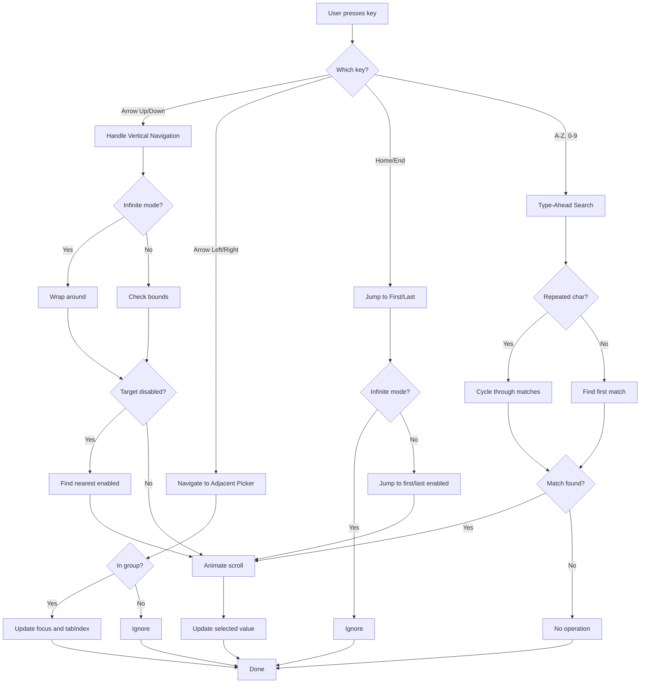

## Overview

React Wheel Picker provides comprehensive keyboard navigation support, allowing users to navigate and select options without a mouse. This includes arrow key navigation, Home/End keys, type-ahead search, and navigation between multiple pickers.

## Navigation Keys

### Vertical Navigation (Within Picker)

#### Arrow Up

Moves selection to the previous item in the list.

```typescript
// From index.tsx:904
ArrowUp: () => handleVerticalNavigation(-1)
```

**Behavior:**
- Scrolls smoothly to the previous option
- Skips disabled items automatically
- In non-infinite mode, stops at the first item
- In infinite mode, wraps to the last item

<CodeGroup>
```tsx Example
<WheelPicker
  options={[
    { value: '1', label: 'Item 1' },
    { value: '2', label: 'Item 2' },
    { value: '3', label: 'Item 3', disabled: true },
    { value: '4', label: 'Item 4' },
  ]}
  defaultValue="2"
/>
// Arrow Up from Item 2 → Item 1
// Arrow Up from Item 1 → stays at Item 1 (non-infinite)
```

```tsx Infinite Mode
<WheelPicker
  options={hours}
  infinite
  defaultValue="01"
/>
// Arrow Up from 01 → 12 (wraps around)
```
</CodeGroup>

#### Arrow Down

Moves selection to the next item in the list.

```typescript
// From index.tsx:905
ArrowDown: () => handleVerticalNavigation(1)
```

**Behavior:**
- Scrolls smoothly to the next option
- Skips disabled items automatically  
- In non-infinite mode, stops at the last item
- In infinite mode, wraps to the first item

### Horizontal Navigation (Between Pickers)

#### Arrow Left

Navigates to the previous picker in a group.

```typescript
// From index.tsx:906-909
ArrowLeft: () => {
  event.preventDefault();
  navigateToPicker("prev");
}
```

**Behavior:**
- Only works when pickers are wrapped in `WheelPickerWrapper`
- Moves focus to the previous picker
- Wraps to the last picker when at the first
- Updates `tabIndex` and DOM focus

<CodeGroup>
```tsx Example
<WheelPickerWrapper>
  <WheelPicker options={hours} />    {/* Picker 0 */}
  <WheelPicker options={minutes} />  {/* Picker 1 */}
  <WheelPicker options={seconds} />  {/* Picker 2 */}
</WheelPickerWrapper>

// When focused on minutes (Picker 1):
// Arrow Left → focus moves to hours (Picker 0)
```

```typescript Implementation
const navigateToPicker = useCallback(
  (direction: "prev" | "next") => {
    const pickerIndex = pickerIndexRef.current;
    if (!group || pickerIndex === -1) return;
    
    const sortedIndices = group.getPickerIndices();
    const currentPos = sortedIndices.indexOf(pickerIndex);
    
    let targetPos: number;
    if (direction === "prev") {
      targetPos = currentPos > 0 ? currentPos - 1 : sortedIndices.length - 1;
    } else {
      targetPos = currentPos < sortedIndices.length - 1 ? currentPos + 1 : 0;
    }
    
    const targetIndex = sortedIndices[targetPos];
    const targetRef = group.getPickerRef(targetIndex);
    
    if (targetRef) {
      containerRef.current.tabIndex = -1;
      targetRef.tabIndex = 0;
      group.setActiveIndex(targetIndex);
      targetRef.focus();
    }
  },
  [group]
);
```
</CodeGroup>

#### Arrow Right

Navigates to the next picker in a group.

```typescript
// From index.tsx:910-913
ArrowRight: () => {
  event.preventDefault();
  navigateToPicker("next");
}
```

**Behavior:**
- Only works when pickers are wrapped in `WheelPickerWrapper`
- Moves focus to the next picker
- Wraps to the first picker when at the last

### Jump Navigation

#### Home Key

Jumps to the first item in the list.

```typescript
// From index.tsx:858-871
const handleHome = () => {
  if (infinite) return; // Only in non-infinite mode
  
  event.preventDefault();
  let targetIndex = 0;
  
  // Skip if first item is disabled
  if (options[0]?.disabled) {
    targetIndex = findNearestEnabledIndex(0, 1, options, false);
  }
  
  const step = targetIndex - scrollRef.current;
  if (step !== 0) {
    scrollByStep(step);
  }
};
```

**Behavior:**
- Only available in non-infinite mode
- Scrolls to the first enabled item
- Smooth animation to the top

<Info>
In infinite mode, Home and End keys do nothing since there's no beginning or end.
</Info>

#### End Key

Jumps to the last item in the list.

```typescript
// From index.tsx:873-887
const handleEnd = () => {
  if (infinite) return; // Only in non-infinite mode
  
  event.preventDefault();
  let targetIndex = options.length - 1;
  
  // Skip if last item is disabled
  if (options[targetIndex]?.disabled) {
    targetIndex = findNearestEnabledIndex(targetIndex, -1, options, false);
  }
  
  const step = targetIndex - scrollRef.current;
  if (step !== 0) {
    scrollByStep(step);
  }
};
```

**Behavior:**
- Only available in non-infinite mode
- Scrolls to the last enabled item
- Smooth animation to the bottom

## Type-Ahead Search

Type any character to quickly navigate to matching options.

### How It Works

#### Single Character Search

Typing a single character cycles through options starting with that character:

```typescript
// Type 'J' with these options:
[
  { value: 'apple', label: 'Apple' },
  { value: 'banana', label: 'Banana' },
  { value: 'january', label: 'January' },
  { value: 'june', label: 'June' },
  { value: 'july', label: 'July' },
]

// First 'J' → January
// Second 'J' → June
// Third 'J' → July
// Fourth 'J' → January (cycles back)
```

#### Multi-Character Search

Typing multiple characters finds the first match:

```typescript
// Type 'ju' → June (first match)
// Wait 500ms for timeout
// Type 'jul' → July
```

#### Repeated Character Behavior

Typing the same character multiple times cycles through matches:

```typescript
// Type 'a', 'a', 'a' → 
// First 'a' → Apple
// Second 'aa' → normalized to 'a', finds next → Apricot
// Third 'aaa' → normalized to 'a', finds next → Avocado
```

From `use-typeahead-search.ts:57`:

```typescript
const isRepeated =
  searchTerm.length > 1 &&
  Array.from(searchTerm).every((c) => c === searchTerm[0]);

const normalizedSearch = isRepeated ? searchTerm[0] : searchTerm;
```

### Search Timeout

The search buffer resets after 500ms of inactivity:

```typescript
// From use-typeahead-search.ts:3
const TYPEAHEAD_TIMEOUT_MS = 500;

// From use-typeahead-search.ts:96
timeoutRef.current = setTimeout(() => {
  searchBufferRef.current = "";
  timeoutRef.current = null;
}, TYPEAHEAD_TIMEOUT_MS);
```

### Customizing Search Text

Use `textValue` when labels are React nodes:

```tsx
const countries = [
  {
    value: 'us',
    label: (
      <div className="flex items-center gap-2">
        <span className="text-2xl">🇺🇸</span>
        <span>United States</span>
      </div>
    ),
    textValue: 'United States', // Used for search
  },
  {
    value: 'uk',
    label: (
      <div className="flex items-center gap-2">
        <span className="text-2xl">🇬🇧</span>
        <span>United Kingdom</span>
      </div>
    ),
    textValue: 'United Kingdom',
  },
];

<WheelPicker options={countries} />
// Type 'u' → cycles between US and UK
// Type 'un' → United States (first match)
```

From `index.tsx:28`:

```typescript
const getOptionTextValue = <T extends WheelPickerValue>(
  option: WheelPickerOption<T>
): string => {
  return (
    option.textValue ??
    (typeof option.label === 'string' ? option.label : String(option.value))
  );
};
```

### Disabled Items

Type-ahead search only considers enabled options:

```typescript
// Filter out disabled options
const enabledOptionsMap = useMemo(() => {
  const map = new Map<number, number>();
  const reverseMap = new Map<number, number>();
  const enabled: WheelPickerOption<T>[] = [];
  
  options.forEach((option, index) => {
    if (!option.disabled) {
      const enabledIndex = enabled.length;
      map.set(enabledIndex, index);
      reverseMap.set(index, enabledIndex);
      enabled.push(option);
    }
  });
  
  return { enabled, map, reverseMap };
}, [options]);

const { handleTypeaheadSearch } = useTypeaheadSearch(
  enabledOptionsMap.enabled, // Only enabled options
  // ...
);
```

## Complete Navigation Example

```tsx
import { WheelPicker, WheelPickerWrapper } from 'react-wheel-picker';

function TimePicker() {
  const [time, setTime] = useState({ hours: '09', minutes: '00', period: 'AM' });
  
  const hours = Array.from({ length: 12 }, (_, i) => ({
    value: String(i + 1).padStart(2, '0'),
    label: String(i + 1).padStart(2, '0'),
  }));
  
  const minutes = Array.from({ length: 60 }, (_, i) => ({
    value: String(i).padStart(2, '0'),
    label: String(i).padStart(2, '0'),
  }));
  
  const periods = [
    { value: 'AM', label: 'AM' },
    { value: 'PM', label: 'PM' },
  ];
  
  return (
    <div>
      <h2>Select Time</h2>
      <WheelPickerWrapper>
        <WheelPicker
          options={hours}
          value={time.hours}
          onValueChange={(hours) => setTime(prev => ({ ...prev, hours }))}
        />
        <span>:</span>
        <WheelPicker
          options={minutes}
          value={time.minutes}
          onValueChange={(minutes) => setTime(prev => ({ ...prev, minutes }))}
        />
        <WheelPicker
          options={periods}
          value={time.period}
          onValueChange={(period) => setTime(prev => ({ ...prev, period }))}
        />
      </WheelPickerWrapper>
      
      <div>
        <h3>Keyboard Instructions:</h3>
        <ul>
          <li><kbd>Tab</kbd> - Focus the time picker</li>
          <li><kbd>↑</kbd> <kbd>↓</kbd> - Change the value in current picker</li>
          <li><kbd>←</kbd> <kbd>→</kbd> - Move between hours, minutes, and period</li>
          <li><kbd>0-9</kbd> - Type to search (e.g., type "3" to jump to 03)</li>
          <li><kbd>Home</kbd> - Jump to first item (01 or 00)</li>
          <li><kbd>End</kbd> - Jump to last item (12 or 59)</li>
        </ul>
      </div>
    </div>
  );
}
```

## Navigation Flow Diagram



## Handling Disabled Items

The navigation automatically skips disabled items using `findNearestEnabledIndex`:

```typescript
// From index.tsx:37-89
const findNearestEnabledIndex = <T extends WheelPickerValue>(
  startIndex: number,
  direction: 1 | -1,
  options: WheelPickerOption<T>[],
  infinite: boolean
): number => {
  if (options.length === 0) return startIndex;
  
  // Check if all items are disabled
  const hasEnabledItem = options.some((opt) => !opt.disabled);
  if (!hasEnabledItem) return startIndex;
  
  const searchInDirection = (dir: 1 | -1): number => {
    let currentIndex = startIndex;
    let attempts = 0;
    const maxAttempts = options.length;
    
    while (attempts < maxAttempts) {
      currentIndex = currentIndex + dir;
      
      if (infinite) {
        // Wrap around for infinite mode
        currentIndex = ((currentIndex % options.length) + options.length) % options.length;
      } else {
        // Clamp for non-infinite mode
        if (currentIndex < 0 || currentIndex >= options.length) {
          return -1;
        }
      }
      
      if (!options[currentIndex]?.disabled) {
        return currentIndex;
      }
      
      attempts++;
    }
    
    return -1;
  };
  
  // First, search in the given direction
  let nearestIndex = searchInDirection(direction);
  
  // If not found, reverse and search the other direction
  if (nearestIndex === -1) {
    nearestIndex = searchInDirection((direction * -1) as 1 | -1);
  }
  
  return nearestIndex === -1 ? startIndex : nearestIndex;
};
```

**Example:**

```tsx
const options = [
  { value: '1', label: 'Item 1' },
  { value: '2', label: 'Item 2', disabled: true },
  { value: '3', label: 'Item 3', disabled: true },
  { value: '4', label: 'Item 4' },
];

// Currently at Item 1
// Press Arrow Down → jumps to Item 4 (skips disabled 2 and 3)
```

## Best Practices

### 1. Always Use WheelPickerWrapper for Multiple Pickers

<CodeGroup>
```tsx Good
<WheelPickerWrapper>
  <WheelPicker options={hours} />
  <WheelPicker options={minutes} />
</WheelPickerWrapper>
// Arrow Left/Right works
```

```tsx Bad
<div>
  <WheelPicker options={hours} />
  <WheelPicker options={minutes} />
</div>
// Arrow Left/Right doesn't work
```
</CodeGroup>

### 2. Provide Instructions for Keyboard Users

```tsx
<div>
  <label id="time-picker-label">Select Time</label>
  <p id="time-picker-help">
    Use arrow keys to navigate, type numbers to search.
  </p>
  <WheelPickerWrapper
    aria-labelledby="time-picker-label"
    aria-describedby="time-picker-help"
  >
    {/* pickers */}
  </WheelPickerWrapper>
</div>
```

### 3. Use Infinite Mode for Cyclical Data

```tsx
// Good for hours (1-12 cycles)
<WheelPicker options={hours} infinite />

// Not good for dates (Jan 1 - Dec 31 doesn't cycle)
<WheelPicker options={dates} infinite={false} />
```

### 4. Set Meaningful textValue for Complex Labels

```tsx
const options = [
  {
    value: 'option1',
    label: <CustomComponent data={...} />,
    textValue: 'Option 1', // Required for search
  },
];
```

### 5. Test Keyboard Navigation Thoroughly

- Test with `Tab` key to ensure proper focus order
- Verify Arrow keys work in all directions
- Test type-ahead with various inputs
- Ensure disabled items are skipped
- Test with infinite and non-infinite modes

<Tip>
Use the browser's accessibility inspector to verify focus management and keyboard interactions.
</Tip>

## Common Patterns

### Date Picker with Keyboard Navigation

```tsx
function DatePicker() {
  const months = ['Jan', 'Feb', 'Mar', /* ... */].map((label, i) => ({
    value: String(i + 1).padStart(2, '0'),
    label,
    textValue: label, // For type-ahead: type 'j' for Jan/Jun
  }));
  
  const days = Array.from({ length: 31 }, (_, i) => ({
    value: String(i + 1),
    label: String(i + 1),
  }));
  
  const years = Array.from({ length: 100 }, (_, i) => ({
    value: String(2024 - i),
    label: String(2024 - i),
  }));
  
  return (
    <WheelPickerWrapper>
      <WheelPicker options={months} defaultValue="01" />
      <WheelPicker options={days} defaultValue="1" />
      <WheelPicker options={years} defaultValue="2024" />
    </WheelPickerWrapper>
  );
  // Home/End to jump to first/last
  // Type '2' to jump to February or any year starting with 2
  // Arrow keys to navigate between month, day, year
}
```

### Time Picker with Disabled Past Times

```tsx
function TimePicker({ minTime }: { minTime: string }) {
  const hours = Array.from({ length: 24 }, (_, i) => {
    const hour = String(i).padStart(2, '0');
    return {
      value: hour,
      label: hour,
      disabled: hour < minTime.split(':')[0], // Disable past hours
    };
  });
  
  return (
    <WheelPicker 
      options={hours}
      // Keyboard navigation automatically skips disabled hours
    />
  );
}
```